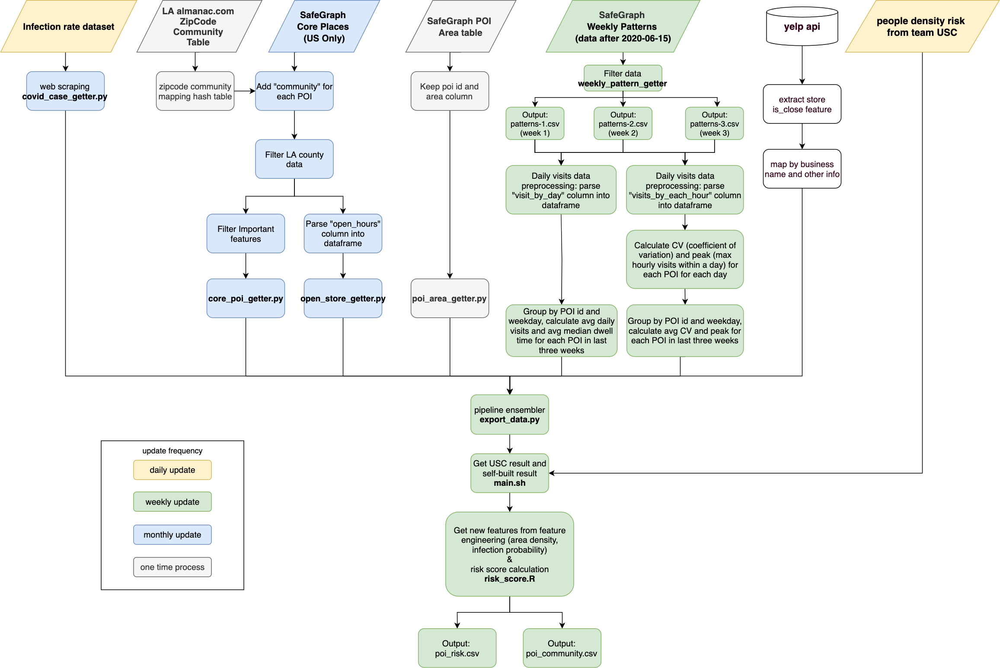
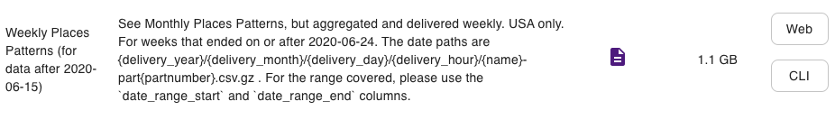
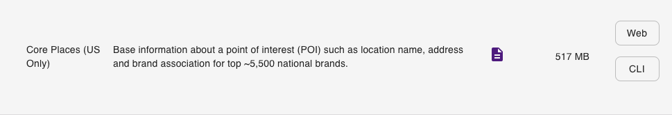
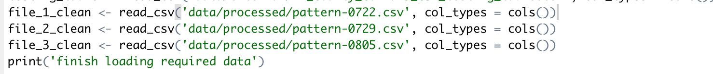

# RMDS_COVID19_riskgenerator
## Project structure
The project is an extension and computation optimized version of team [RPI](https://github.com/Yueyang-Li-Elfa/Risk-Score-RPI-Solver) who participate the 2020 COVID-19 challenge held by [RMDS Lab](https://grmds.org/2020challenge). The orignal project was reviewed by a panel of judges from the City of LA, LA County Department of Public Health, Chamber of Commerce, and academia. This project produce a risk score of infection cases and its according risk level from a variety a data sources, including:
1. POI (Point of Interest) data gathered from [SafeGraph](https://www.safegraph.com/), 
2. third party POI area data store in SafeGraph, 
3. COVID-19 cases from [lacounty.gov](http://dashboard.publichealth.lacounty.gov/covid19_surveillance_dashboard)
4. People density from team USC
5. Yelp API. 

The project structure is as follows:



## How to use this script
1. Clone the whole repository from GitHub

2. Pre-Download data:
A total of 7 files need to download (Don't worry, we have example data for you soon!). No need to unzip the file, just download and keep it original format. Store all the data into `/data/external/` folder:

    * **Data from SafeGraph.com: Need to apply an account**
    * **Consecutive 3 weeks of user patterns**: Weekly Places Patterns (1-3)
    
    * **POI (Point of Interest) data**: Core Places (US Only) (4)
     
    * Third party precalculated data saved in SafeGraph.com:
    * **POI area square foot data**: Need to download from AWS CLI (stored in S3) (5)
    ```
    aws s3 cp s3://sg-c19-response/geo-supplement/May2020Release/SafeGraphPlacesGeoSupplementSquareFeet.csv.gz <your_local_path> --profile safegraphws --endpoint https://s3.wasabisys.com
    ```
    * **Community Case/Death and Community Testing data**: will be downloaded as you run the script. (2)

3. Check necessary dependencies in `requirements.txt` 
```
pip install -r requirements.txt
```
4. Run the script:
Go to the folder where you clone the files:

4.1 For macOS/Linux system, open terminal

```shell
# make the file executable
chmod 755 main.sh
# run the shell script
sh main.sh
```

4.2 You will get the following data:
    1. RMDS_open_hours.csv 
    2. RMDS_poi_area_square_feet.csv
    3. RMDS_poi.csv
    4. RMDS_zipcode_mapper.json
    5. pattern-<date>.csv * 3
    6. LA_County_Covid19_CSA_case_death_table.csv
    7. LA_County_Covid19_CSA_testing_table.csv
        
4.3 Get the risk score: Open R and edit the correct weekly pattern
    
    * You will get POI risk score and community risk score in `data/result` folder
        1. risk_poi-YYYY-MM-DD.csv
        2. risk_community-YYYY-MM-DD.csv

