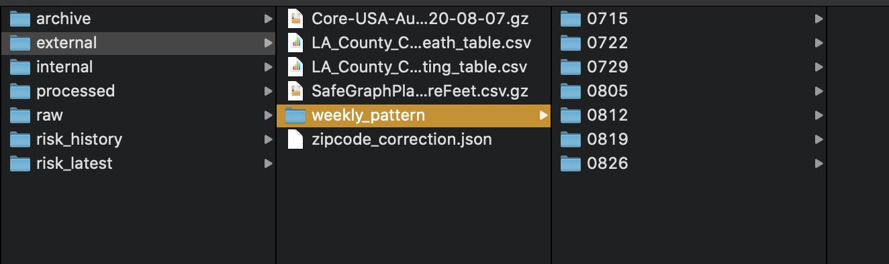

# RMDS_COVID19_riskgenerator
## Project structure
The project is an extension and computation optimized version of team [RPI](https://github.com/Yueyang-Li-Elfa/Risk-Score-RPI-Solver) who participate the 2020 COVID-19 challenge held by [RMDS Lab](https://grmds.org/2020challenge). The orignal project was reviewed by a panel of judges from the City of LA, LA County Department of Public Health, Chamber of Commerce, and academia. This project produce a risk score of infection cases and its according risk level from a variety a data sources, including:
1. POI (Point of Interest) data gathered from [SafeGraph](https://www.safegraph.com/)
2. Third party POI area data store in SafeGraph
3. COVID-19 cases from [lacounty.gov](http://dashboard.publichealth.lacounty.gov/covid19_surveillance_dashboard)
4. People density from team [USC](https://github.com/ANRGUSC/covid19_risk_estimation)
5. Yelp API

The project structure is as follows:


## How to use this script
1. Clone the whole repository from GitHub

2. Pre-Download data:
A total of 7 files, 5 need to be downloaded (Example data for you soon!). **No need to unzip the file**, just download and keep it original format. Store all the data into `/data/external/` folder and some data need some extra assistant, see in the below list. (Data from SafeGraph.com Need to apply an account): 
    * **SafeGraph consecutive 3 weeks of user patterns**: There are several files for one single day, please store the data into `data/external/weekly_pattern` arrange into one subfolder for a single day. For example, for week ended on 0812, we create a folder call 0812 `data/external/weekly_pattern/0812`(1-3)
    
    
    * **SafeGraph POI (Point of Interest) data**: Core Places (US Only) (4)
     
    * **POI area square foot data** (party precalculated data): Need to download from AWS CLI (stored in S3) (5)
    ```
    aws s3 cp s3://sg-c19-response/geo-supplement/May2020Release/SafeGraphPlacesGeoSupplementSquareFeet.csv.gz <your_local_path> --profile safegraphws --endpoint https://s3.wasabisys.com
    ```
    * **Community Case/Death and Community Testing data** from [lacounty.gov](http://dashboard.publichealth.lacounty.gov/covid19_surveillance_dashboard/):
        * Click `[Table: Community Case/Death]`, then click download (6)
        * Click `[Table: Community Testing]`, then click download (7)
        

3. Check necessary dependencies in `requirements.txt` or use `pyproject.toml` (recommended), then make sure you download AWS cli 1.
```
# solution1
pip install -r requirements.txt

# solution2
pip install poetry
poetry install
poetry lock
```
4. Run the script:
Go to the folder where you clone the files:

    1. For macOS/Linux system, open terminal

    ```shell
    # make the file executable
    chmod 755 main.sh
    # run the shell script + assign 3 weekly pattern folders you created earlier, for example:
    sh main.sh 0812 0819 0826
    ```

5. Result
    1. You will get the processed data in `data/processed`:

        1. **RMDS_open_hours.csv**
        2. **RMDS_poi_area_square_feet.csv**
        3. **RMDS_poi.csv**
        4. **RMDS_zipcode_mapper.json**
        5. **pattern-<date>.csv * 3**
        6. **LA_County_Covid19_CSA_case_death_table.csv**
        7. **LA_County_Covid19_CSA_testing_table.csv**
        
    3. You will also get the risk score result in `data/result`:

        

            1. **risk_poi-YYYY-MM-DD.csv**
            2. **risk_community-YYYY-MM-DD.csv**

